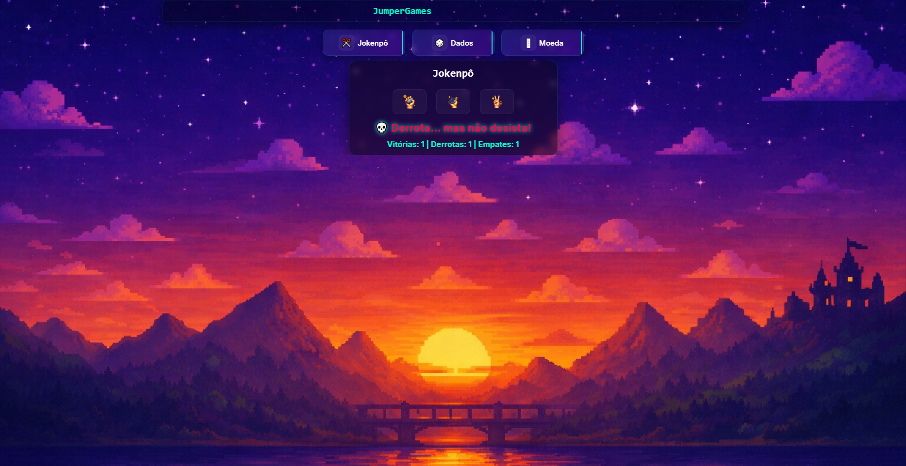
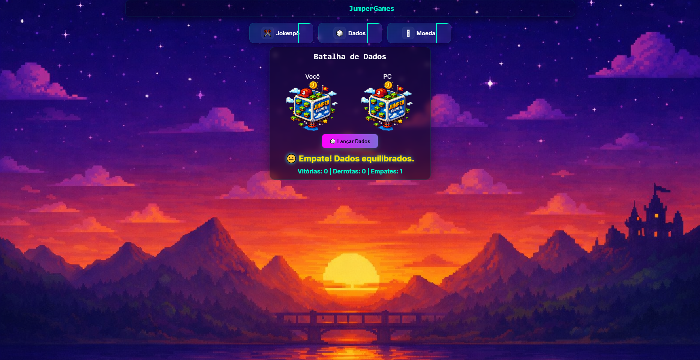
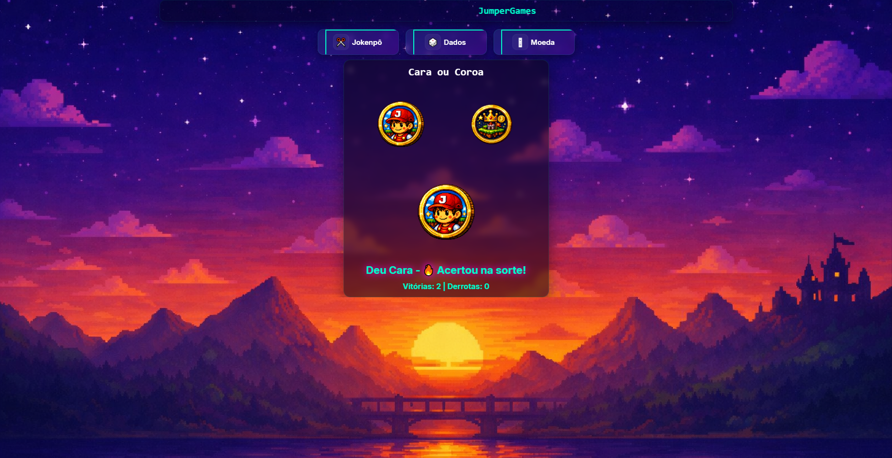

<<<<<<< HEAD

# 🎮 Arcade JS | Mini Games em JavaScript
=======
# 🎮 Arcade JS | JumperGames 2.0
>>>>>>> e32634acaecf327cbc0a7429447a11980183b88d

**Colégio ULBRA São Lucas - Curso Técnico em Informática**  
*Projeto desenvolvido para o módulo de Lógica e Programação Web.*

---

## 🎯 Sobre o Projeto

<<<<<<< HEAD
Este repositório reúne três mini games clássicos implementados em **HTML, CSS e JavaScript**:
- ✊✋✌️ Pedra, Papel ou Tesoura (Jokenpô)  
- 🎲 Batalha de Dados  
- 🪙 Cara ou Coroa  

O objetivo é aplicar conceitos de lógica de programação e manipulação do DOM, criando interfaces visuais dinâmicas e interativas.

---

## ✨ Funcionalidades Gerais
- Interface gráfica futurista com animações em CSS.  
- Jogadas aleatórias geradas pela IA com `Math.random()`.  
- Lógica de vitória, derrota e empate em cada jogo.  
- Placar dinâmico atualizado em tempo real.  
- Atualização do DOM sem recarregar a página.  

---

## 🚀 Tecnologias Utilizadas
- **HTML5** → Estruturação semântica da página.  
- **CSS3** → Estilização visual, animações e layout responsivo.  
- **JavaScript (ES6)** → Manipulação do DOM, eventos e lógica dos jogos.  

---

## 🎮 Como Jogar

### ✊✋✌️ Jokenpô
1. Clique em **Pedra**, **Papel** ou **Tesoura**.  
2. O computador escolhe automaticamente.  
3. O resultado aparece com animação e o placar é atualizado.  

### 🎲 Batalha de Dados
1. Clique em **🎲 Lançar Dados** ou no dado do jogador.  
2. O computador rola o dado automaticamente.  
3. O maior valor vence a rodada e o placar é atualizado.  

### 🪙 Cara ou Coroa
1. Clique em **Cara** ou **Coroa**.  
2. O computador sorteia o resultado.  
3. O resultado aparece com animação e o placar é atualizado.  


## 📸 Demonstração Visual

### Jokenpô


### Batalha de Dados


### Cara ou Coroa



## ⚙️ Como executar o projeto localmente
1. Clone este repositório:
   ```bash
   git clone https://github.com/Erick-Matheus25/TrabalhoJumperGames
=======
O **JumperGames 2.0 (Arcade JS)** é uma plataforma de mini jogos interativos desenvolvida com HTML, CSS e JavaScript puro, sem frameworks.

O projeto funciona como um arcade digital, onde o usuário escolhe diferentes mini jogos em uma única interface.

O objetivo é praticar:

- Lógica de programação
- Manipulação do DOM
- Eventos em JavaScript
- Estruturas condicionais e aleatoriedade
- Controle de estado da aplicação
- Animações e interatividade

---

## 🎮 Jogos disponíveis

### ✊ Jokenpô
- Pedra, Papel ou Tesoura
- Jogador vs computador
- Resultado: vitória, empate ou derrota

### 🎲 Dados
- Simulação de dado
- Animação de rolagem
- Maior número vence

### 🪙 Cara ou Coroa
- Escolha entre cara ou coroa
- Resultado aleatório
- Animação de moeda

### 💡 Controle de Luz
- Interruptor digital
- Alterna entre luz ligada/desligada
- Mudança de cenário (quarto claro/escuro)

### 🏦 Cofrinho Digital
- Adicionar moedas (0,10 / 0,25 / 0,50 / 1,00)
- Mostrar saldo atualizado
- Sistema de saque
- Botão de esvaziar cofre

### 🍅 Pomodoro
- Timer de 25 minutos
- Iniciar, pausar e resetar
- Contagem regressiva

### 🎹 Teclado Musical
- 7 teclas (Dó a Si)
- Sons em MP3
- Suporte ao teclado físico (A S D F G H J)
- Feedback visual ao tocar notas

---

## ▶️ Como jogar

1. Abra o projeto no navegador (index.html)
2. No menu principal, escolha um dos jogos disponíveis
3. Clique em **PLAY GAME**
4. Siga as instruções de cada jogo na tela
5. Tente vencer os desafios sem perder todas as vidas ❤️

---

## ✨ Funcionalidades gerais

- Menu com seleção de jogos
- Sistema de vidas (❤️)
- Telas de vitória e game over
- Sons de vitória e derrota
- Atualização dinâmica do DOM
- Uso de Math.random()
- Uso de setInterval e clearInterval
- Animações em CSS

---

## 🚀 Tecnologias utilizadas

- HTML5
- CSS3
- JavaScript (Vanilla JS)
- DOM Manipulation
- Audio API
- setInterval / clearInterval

---


⚙️ Como funciona o projeto
abrirJogo() → abre os jogos
innerHTML → troca telas dinamicamente
Math.random() → sorteios aleatórios
perderVida() → sistema de vidas
mostrarVictory() → tela de vitória
setInterval() → animações e timers
Audio() → sons do jogo

## 🎬 Demonstração

)
![Dados]
![Moeda]!()
)
)
)
![TECLADO]!


---

💡 Melhorias futuras
Ranking de jogadores
LocalStorage
Novos mini jogos
Responsividade mobile
Sistema de pontuação geral
Multiplayer local

## ▶️ Como executar o projeto

1. Clone o repositório:

```bash
https://erick-matheus25.github.io/Jumpergames2.0/
>>>>>>> e32634acaecf327cbc0a7429447a11980183b88d
